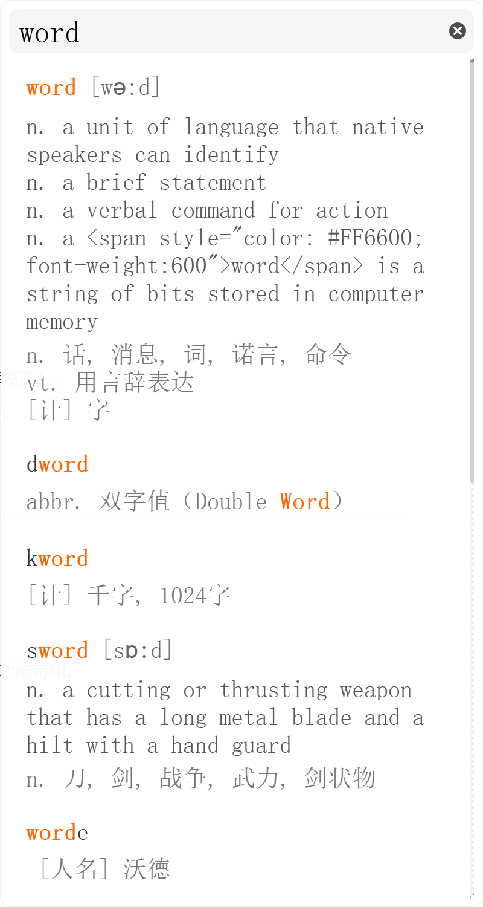

# QuickLex

Free Quick English to Chinese Dictionary.

## 简介

这是一个基于 PyQt5 的 Windows 本地查词工具，可通过全局快捷键（Ctrl+1）快速唤出窗口查询单词，支持 .db 词库。

日常在电脑上看英语文档或者其他英语资料时经常会遇到生词，一直想要一个方便的查词工具，找了一圈还是自己写一个吧

本地词库我用的是韦神的[ECDICT](https://github.com/skywind3000/ECDICT.git)，其他词库可能要改下数据库接口。

程序入口：main.py
支持功能：

- 全局快捷键显示/隐藏窗口（Ctrl + 1）
- 默认情况（无输入）窗口只有一个输入框，输入单词后窗口自动根据查询内容延申窗口
- 简约的UI界面

## TODO List

- 查询缓存机制
- 后台内存占用优化
- 修复特定情况下的窗口伸缩BUG
- 用户交互优化

### 初始窗口

### 查询结果

